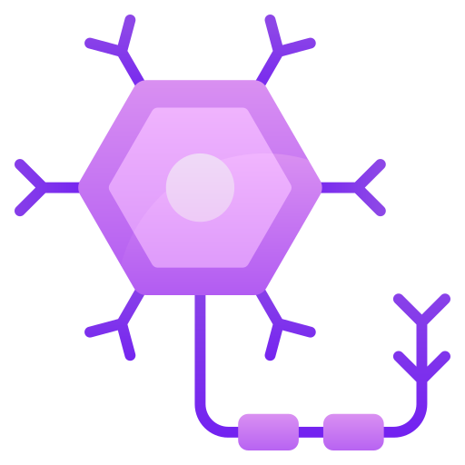

<table width="100%">
<tr>
<td align="center" width="42%">

  

 

</td>
<td align="left" width="58%">

</td>
</tr>
</table>

---

##  About Me

- Biomedical Engineering MSc student exploring the meeting point of **engineering**, **brain science**, and **computation**
- Working on **EEG signal processing**, **biomedical data analysis**, and **brain signal decoding**
- Especially interested in **computational neuroscience**, **neural systems**, and **AI for healthcare**
- Drawn to projects that connect **biology**, **modeling**, and **intelligent systems**

---

##  Technical Skills

### Programming

### ML / Data Tools

### Neuro / Imaging Tools

### Software & Platforms

---

## GitHub Signals

  
  

---

## Quote

> "Any man could, if he were so inclined, be the sculptor of his own brain."
>
> Santiago Ramon y Cajal

---

## Connect With Me

  
  <strong> GitHub:</strong> <a href="https://github.com/Parichehr13">Parichehr13</a>

  
  <strong> LinkedIn:</strong> <a href="https://www.linkedin.com/in/parichehr-moradi-82b0121a9">parichehr-moradi-82b0121a9</a>

